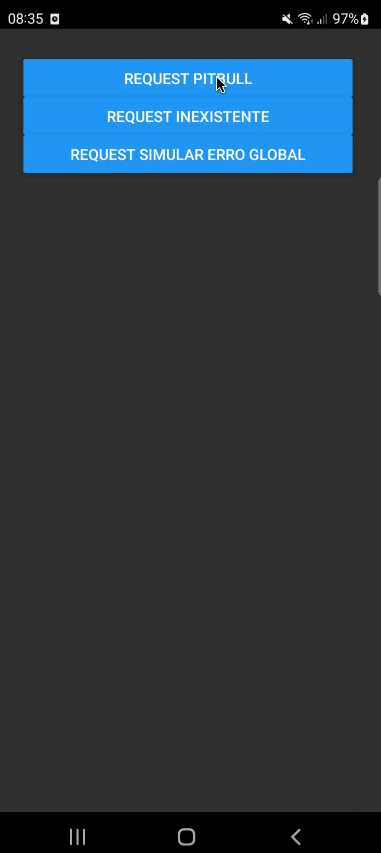
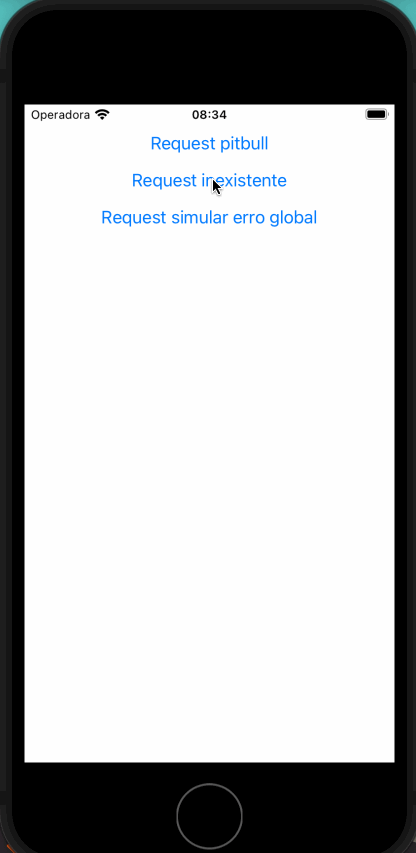
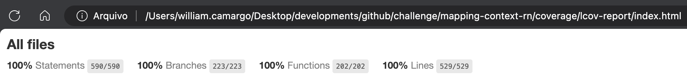

# mapping-context-rn

O `mapping-context-rn` é o repositório responsável por centralizar componentes não visuais, sem regra de negócio, para serem utilizados nos repositórios do SuperApp. Ele possui componentes como contextos compartilhados (usuário logado), _hooks_.

## Aplicação em tempo real

### Android

### iOS

## Cobertura do código

